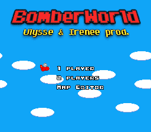

# BomberWorld

SNES homebrew inspired by the [Bomber](https://www.mobygames.com/game/cpc/bomber_________) Amstrad CPC game.

[](https://travis-ci.com/1r3n33/bomberworld)
[](https://github.com/1r3n33/bomberworld/releases/latest)

## Screenshots



## Installation on Linux

### Wine

Most of the toolchain is Windows-based.

Install [Wine](https://www.winehq.org/) to properly build the project and run the tools.

```bash
sudo apt-get install wine
```

### PVSnesLib

1. Install the following fork of the [PVSnesLib](https://www.portabledev.com/jeux/supernes/pvsneslib/) SDK:
   ```bash
   git clone -b local-dev-env git@github.com:1r3n33/pvsneslib.git
   ```
   This fork contains tooling bug-fixes and Wine wrappers.

2. Set up the `DEVKITSNES` and the `DEVKIT65XX` environment variables:
   ```bash
   export DEVKITSNES=<full_path_to>/pvsneslib
   export DEVKIT65XX=$DEVKITSNES/devkitsnes
   ```

## GraphicsGale

Install [GraphicsGale](https://graphicsgale.com/us/) to edit `.gal` files in the `gfx` folder and export bitmaps.

## Emulators

### bsnes

Install [bsnes](https://byuu.org/bsnes) to play the game. (Linux binaries are available)

### no$sns

If you want to inspect the runtime, install [no$sns](https://problemkaputt.de/sns.htm).
